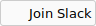

# readme-button-generator

[](https://travis-ci.org/adalinesimonian/readme-button-generator)

Node module that generates a button for use in a readme.

## Getting started

> **Note:** You'll need Node.js 12.20 or later as this module uses ES modules.

```
$ npm i --save readme-button-generator
```

## Usage

```javascript
const ButtonGenerator = require('readme-button-generator')

// Synchronous
const generator = new ButtonGenerator()

// Asynchronous (only for default template)
const generator = await ButtonGenerator.createAsync()

let svg = await generator.generate({
  text: 'Join Slack',
  images: {
    icon: {
      url: 'https://upload.wikimedia.org/wikipedia/commons/7/76/Slack_Icon.png'
    }
  }
})
```

Result:



You can then take the output and send it to [svgo](https://github.com/svg/svgo), [svg2png](https://github.com/domenic/svg2png), output it to a file, as an HTTP response - whatever you want!

## Default template options

- `text` - Text to display.
- `icon` - Optional. Data URL for icon to display.
- `width` - Width of button in pixels. Defaults to 96.

## Automatic image embedding and resizing

Since this module is meant to output a button, it wouldn't make sense for it to reference an external URL or include an outrageously huge icon. Therefore, automatic image processing is supported for all templates when using the `images` property of the options object.

The default template uses an `icon` property which is meant to include the data URL which will be placed directly into the SVG output. So let's say our image is larger and sourced from either the filesystem or a remote URL. This can be handled really simply:

```javascript
let svg = await generator.generate({
  // ...
  images: {
    icon: { // Name of data URL property the template is expecting
      url: 'https://remote.url', // OR
      src: 'local.file',
      width: 32, // Optional. Width to resize to. Defaults to 32.
      height: 32 // Optional. Height to resize to. Defaults to 32.
    }
  }
})
```

## Custom templates

Don't like the default template? You can pass in a custom template:

```javascript
const fs = require('fs-extra')
const ButtonGenerator = require('readme-button-generator')

const template = await fs.readFile('my-template.svg', 'utf8')
const generator = new ButtonGenerator(template)
```

Behind the scenes, the module uses [Handlebars](http://handlebarsjs.com/) and [just-handlebars-helpers](https://github.com/leapfrogtechnology/just-handlebars-helpers#helpers), so you can accept whatever options you would like instead of the default template's `text`, `icon`, and `width`.

The only reserved property is `images`, as it is used as noted above to automatically process images. However, you can use whatever property you would like and use the image processing feature to accept a data URL for an arbitrary image.

Feel free to [take a look at the default template](https://github.com/adalinesimonian/readme-button-generator/blob/master/button-template.svg) for inspiration!

## Licence

MIT
